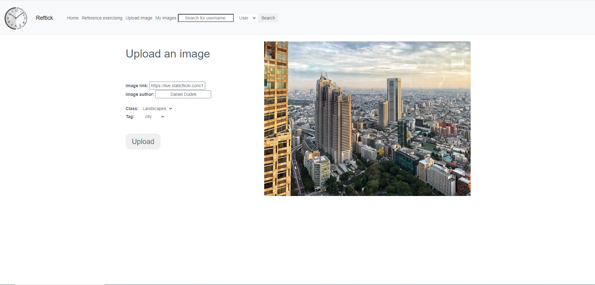

# RefTick

## Description
Web tool to provide reference images for drawing, as well as a timer for practice challenges. Any user can upload images that shall be accessed by any practicing user.

## Visuals
- Home

#
- Logged User

#
- Upload

#
- User's Images

#
- Exercise Settings

#
- Exercise

#
- Search User

#
- Search Tag

#

## Installation
Not available for public use yet. Once it's public, it will be available online hosted by a public server.

In order to test, download the repository and run it with your preferred IDE.
(Built on IntelliJ, therefore, IntelliJ recommended.)

IMPORTANT: Enable third party cookies in your browser, or else you won't be able to use the website properly (functionalities that require login will be compromised).

## Usage
The user will enter the website and provide the wanted tags and challenge size. Then, the tool will choose random reference images for that tag and a timer for each image for the artist to study.

The reference images are both images uploaded by other users and images uploaded by us (the devs).

IMPORTANT: Enable third party cookies in your browser, or else you won't be able to use the website properly (functionalities that require login will be compromised).

## Contributing
Providing images for RefTick once it's possible is a nice way to contribute.

Development contributions are not possible at the moment due to it being a college project.

## Authors
Adriano Elias Andrade

Guilherme Henrique Vasconcelos da Cunha

## License
MIT License

Copyright (c) 2024 Adriano Elias Andrade, Guilherme Henrique Vasconcelos da Cunha

[License provided in the LICENSE file]

## Project status
In development.